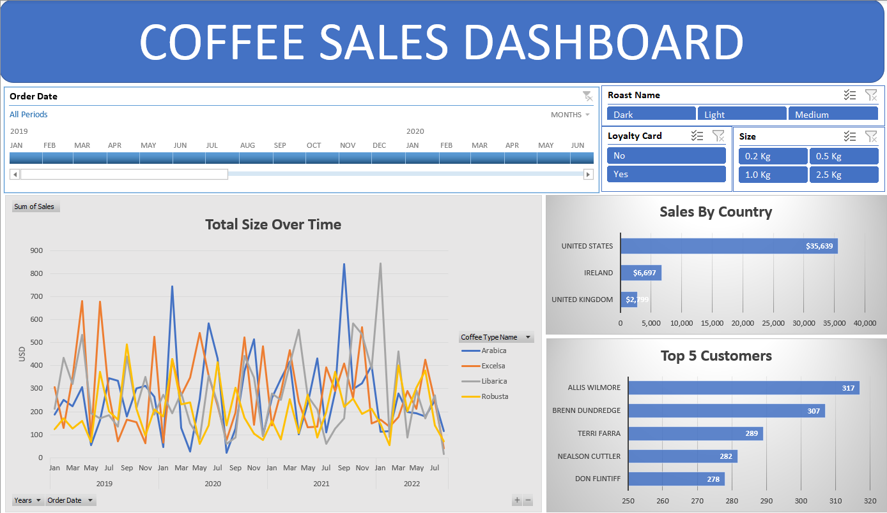

# My Data Analysis Portfolio Projects

 #### Here I share with you the Projects I've done to *Analyze some data* , get some insights from it and make beautiful *Dashboards* out of it!

 ## 🧰 Here Are the Tools that I've Used:
 
- SQL Server (EDA, Data Cleaning)
- Excel (Pivot Tables, Charts)
- Power BI (Dashboards)
  
##### *Here's the Excel Dashboard showing Total sales over time by Roast Names, Total sales by country etc.*

